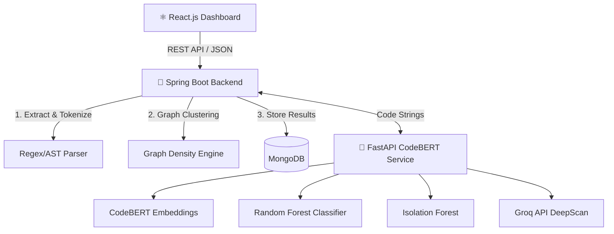

# 🛡️ PlagShield: Advanced AI Code Plagiarism Detection


-FF9D00?logo=huggingface&logoColor=white)

PlagShield is an enterprise-grade, multi-language code plagiarism detection system. It goes beyond simple string matching by utilizing Abstract Syntax Trees (AST) and Deep Learning (CodeBERT) to catch complex cheating techniques like variable renaming, logic obfuscation, and even cross-language translation.

---

## ✨ Core Features

*   **🧠 Deep Learning Embeddings:** Uses Microsoft's **CodeBERT** to understand the semantic intent of code, catching students who rewrite logic entirely.
*   **🤖 ML Classification & Anomalies:** A trained **Random Forest** scores pairs, while an **Isolation Forest** flags zero-day cheating anomalies. Includes **SHAP** matrix values to explain *why* the AI flagged the code.
*   **🕵️ DeepScan (LLM Integration):** Compare two snippets side-by-side and click "Compare Logic" to have an AI (Groq Llama 3) explain the cheating in plain English.
*   **🕸️ Plagiarism Rings:** Uses Graph Theory and density clustering to identify coordinated cheating groups (3+ students sharing code).
*   **📊 Interactive Dashboards:** Similarity heatmaps, force-directed graphs, and side-by-side diff viewers built in React and Tailwind CSS.
*   **📑 Automated Dossiers:** Export beautiful, multi-page PDF reports detailing High-Risk matches, Suspicious clusters, and AI Insights.

---

## 🏗️ Microservice Architecture

PlagShield operates on a decoupled architecture for maximum performance during heavy batch processing.



---

## 💻 Tech Stack

### Frontend (User Interface)
*   **React 18 + Vite:** Lightning-fast rendering.
*   **Tailwind CSS + Framer Motion:** Dark-mode UI with smooth animations.
*   **react-force-graph-2d:** Network mapping of cheating rings.
*   **jsPDF + autoTable:** Client-side PDF generation.

### Backend (Orchestration)
*   **Java Spring Boot 3:** Robust request handling and file management.
*   **MongoDB:** NoSQL storage for massive similarity matrices and submission data.
*   **JGraphT:** Graph algorithms to detect multi-student plagiarism rings.

### Machine Learning (AI Service)
*   **Python + FastAPI:** High-performance async API.
*   **HuggingFace Transformers:** Microsoft `codebert-base`.
*   **Scikit-Learn:** Random Forest & Isolation Forest modeling.
*   **SHAP:** Explainable AI feature importance.
*   **Groq API:** Llama-3 integration for plain-English code analysis.

---

## 🚀 Getting Started

### 1. Prerequisites
*   Node.js (v18+)
*   Java 17+ (Maven)
*   Python 3.9+
*   MongoDB (Running on `localhost:27017`)

### 2. Environment Variables
To enable the **DeepScan LLM** feature, you need a free API key from [Groq](https://console.groq.com/keys).
Create a `.env` file in the `codebert-service/` folder:
```env
GROQ_API_KEY=your_groq_api_key_here
```

### 3. Run the Application
For Windows users, simply run the master startup script from the root directory. It will automatically install dependencies and boot all 3 servers simultaneously.
```powershell
.\start-all.ps1
```

Once running, access the dashboard at:
**http://localhost:5173**

---
*Built with ❤️ for Academic Integrity.*
